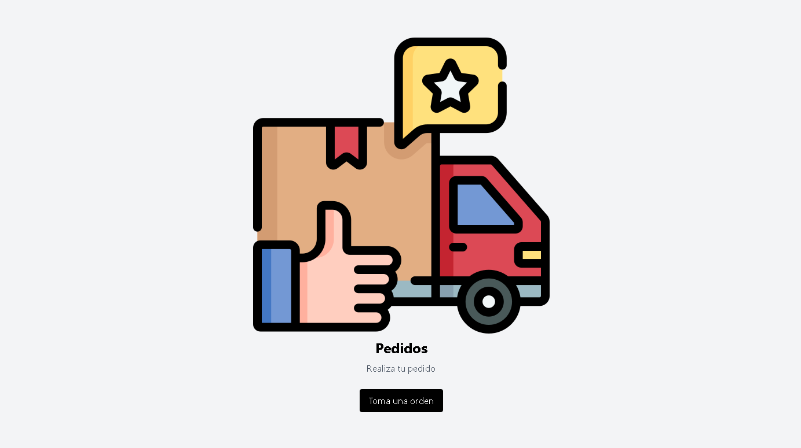
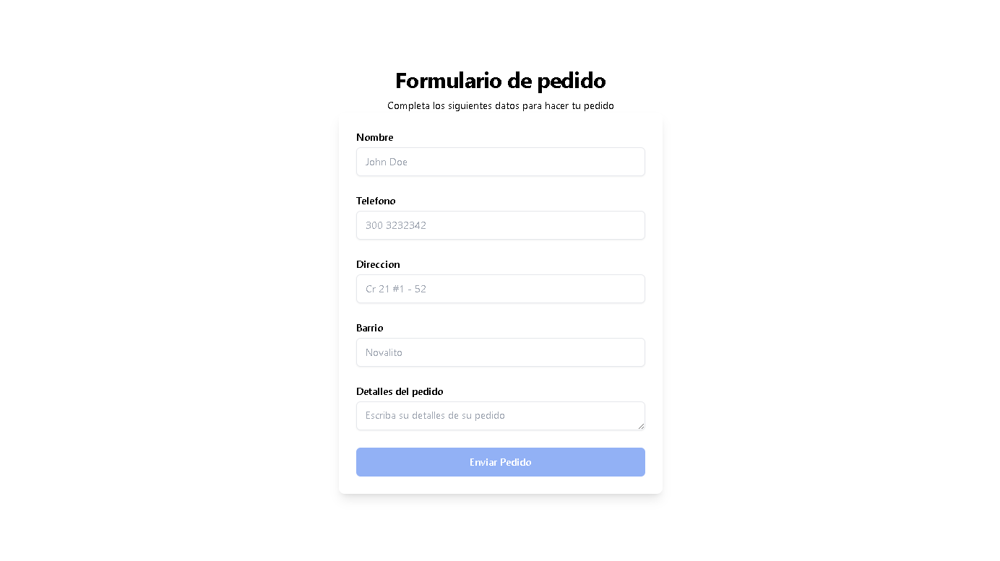
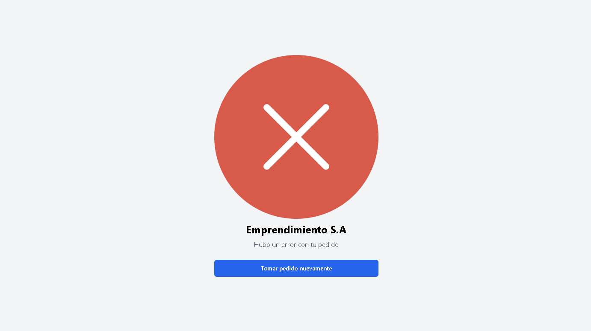

# ServicesWpp

Este proyecto está diseñado para gestionar pedidos generales vinculados a un mismo número, con el objetivo de automatizar el proceso de órdenes y brindar una experiencia de usuario agradable. Proporciona una solución simple y precisa para este servicio en la plataforma de WhatsApp.

El link del proyecto es el siguiente, se realizó el despliegue mediante *Netlify*:
https://appservices.netlify.app/
## Guia para iniciar el proyecto

1. Clonar el respositorio desde la rama Main o Develop

   ```
   git clone -b Develop https://github.com/MiguelAHz2/ServicesWpp.git
   ```
2. Instalar las dependecias del package.json

   ```
   npm install
   ```
3. Correr el Poryecto

   ```
   npm run dev
   ```
4. ApiKeys

   Para conseguir tu apikey seguir paso a paso la documentacion del Api CallmeBot:

   [https://www.callmebot.com/es/blog/api-gratis-mensajes-whatsapp
5. Variables de entorno

   Crear el archivo de variables de entorno, se debe colocar los mismos nombres de variables o si desea colocar sus variables con sus nombres debe modificar el componentes Form.jsx

## Tecnologias

* React + Vite ⚛️
* Tailwind.css 🎨
* (Api) callMeBot

## Preview 📷
<div style="display: flex; width: 350px; gap: 1rem; margin-bottom: 30px;" >
  

  

  

  
</div>


##  Autores 👤
* **Miguel Alvarez** - *Desarrollador* - [😎 Perfil GitHub](https://github.com/MiguelAHz2)
* **Johan Melo** - *Desarrollador* - [😎 Perfil GitHub](https://github.com/Deiverso-JM)
