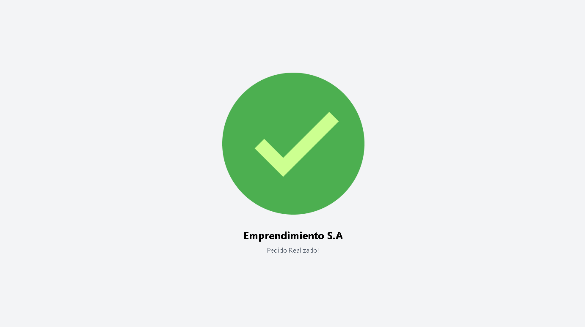

# Preview 📷

  

  

  

  

#  Autores 👤
* **Miguel Alvarez** - *Desarrollador* - [😎 Perfil GitHub](https://github.com/MiguelAHz2)
* **Johan Melo** - *Desarrollador* - [😎 Perfil GitHub](https://github.com/Deiverso-JM)
